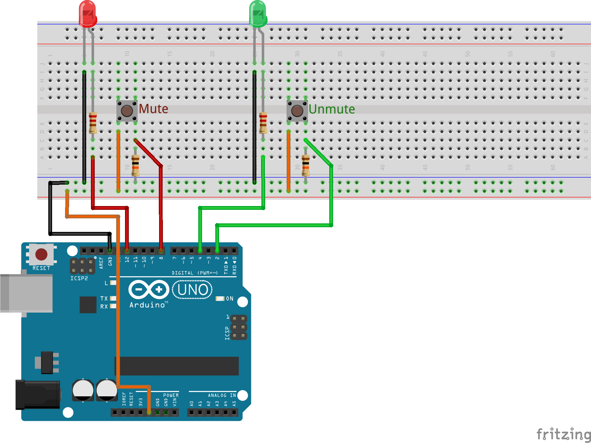

# Zoomino

Control the Zoom mute button with your Arduino.

We live in a world of online meetings. Zoom is a constant presence in many people's life.

Muting when you are not talking is part of the Zoom etiquette but Zoom does not make it very convenient.

If the window is not visible or just not active, keyboard shortcuts don't work. You'll have to find the meeting window, activate it and click the mute/unmute button as needed.

Not anymore. With Zoomino (for lack of a better name) you can just press a button on a physical device and no matter where the Zoom window is, no matter if it's active or not, you'll be able to to mute and unmute yourself extremely easily.

## How does this work?

Zoomino is a simple combination of an Arduino-based board with a couple of push-buttons and colorful LEDs and an application that runs on your computer and tells zoom what to do when the buttons are pressed.

## Shut up and take my money!

Sure, I will happily take your money. However, for now this is more a toy than anything else. It works pretty reliably but there are some limitations. See next section.

## Known issues

 * macOS only
 * No ready to install binaries yet. You'll need to run the Node.js file by yourself.
 * Sometimes Zoom and the LEDs are out of sync for a few seconds.

